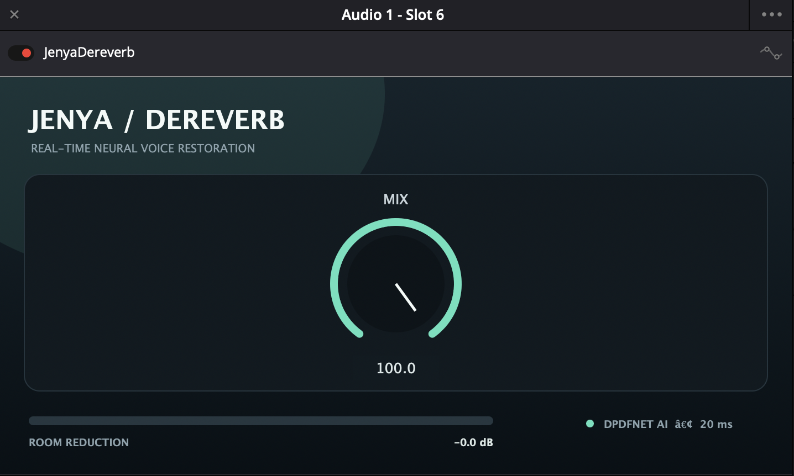

# JenyaDereverb

JenyaDereverb is a compact, real-time neural VST3 for making reverberant spoken voice
drier and more suitable for podcasts, dialogue, and voice-over work. It embeds the
DPDFNet speech-enhancement model and runs locally—no cloud service or account is needed.



## Download and install

The ready-to-use universal macOS plug-in is included at
[`Release/JenyaDereverb.vst3`](Release/JenyaDereverb.vst3). It supports Apple Silicon
and Intel Macs.

1. Download or clone this repository.
2. Copy `Release/JenyaDereverb.vst3` to `~/Library/Audio/Plug-Ins/VST3/`.
3. Restart the DAW. In DaVinci Resolve, rescan audio plug-ins if it does not appear.

The release is ad-hoc signed. macOS may require a locally trusted signature or removal
of downloaded-file quarantine metadata before third-party hosts can scan it.

## Use

JenyaDereverb has one control:

- **Mix** blends latency-aligned original audio with neural processing. It defaults to
  100%, which applies maximum enhancement and hall removal with voice protection off.

The neural model operates at 48 kHz, the standard rate for DaVinci Resolve and video
post-production. At other sample rates the plug-in safely passes audio through. Reported
latency is 960 samples (20 ms at 48 kHz).

## Build from source

Requirements: macOS, Xcode command-line tools, CMake 3.22+, Git, and a C++17 compiler.
JUCE 8.0.4 is fetched during configuration. The model, ONNX Runtime headers, and stripped
universal ONNX Runtime library needed by the build are included.

```sh
cmake -S . -B build-release \
  -DCMAKE_BUILD_TYPE=Release \
  -DCMAKE_OSX_ARCHITECTURES="arm64;x86_64"
cmake --build build-release --config Release -j 4 --target ClearRoom_VST3
```

The output is `build-release/ClearRoom_artefacts/Release/VST3/JenyaDereverb.vst3`.

```sh
cmake --build build-release --config Release -j 4 --target ClearRoomTests
./build-release/ClearRoomTests_artefacts/Release/ClearRoomTests
```

## Compatibility

- VST3 effect, version 0.3.1
- macOS universal binary (`arm64` and `x86_64`)
- Mono, stereo, and matching multichannel layouts through 16 channels
- Tested for construction and 5.1 layout support expected by Fairlight

## Open-source components

The neural path uses the Apache-2.0-licensed DPDFNet model and MIT-licensed ONNX Runtime.
Earlier WPE research code is retained. See [`THIRD_PARTY_NOTICES.md`](THIRD_PARTY_NOTICES.md)
and [`docs/OPEN_SOURCE_REVIEW.md`](docs/OPEN_SOURCE_REVIEW.md).

## Important limitation

De-reverberation cannot reconstruct information that was never captured. Very distant,
clipped, or extremely reverberant recordings may still produce artifacts. Always keep
the original recording.
